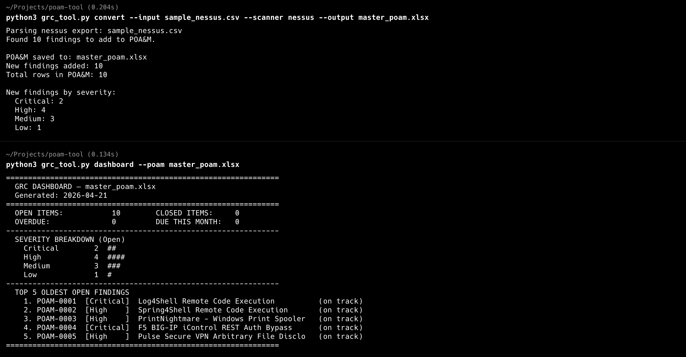

# FedRAMP POA&M GRC Tool

A CLI tool that converts vulnerability scanner exports into a FedRAMP-compliant POA&M Excel file and manages the full finding lifecycle through the CLI.

---

## Setup

```bash
pip install openpyxl
```

---

## Files

| File | Purpose |
|---|---|
| `grc_tool.py` | Main CLI — use this for everything |
| `poam_converter.py` | Scanner parsing engine (used internally by grc_tool.py) |
| `sample_nessus.csv` | Sample Nessus export for testing |
| `sample_wiz.csv` | Sample Wiz export for testing |

---

## Supported Scanners

`nessus` · `tenable` · `qualys` · `wiz` · `generic`

---

## Commands

### convert
Import scanner findings into a POA&M. Duplicates are skipped automatically.

```bash
python3 grc_tool.py convert --input sample_nessus.csv --scanner nessus --output master_poam.xlsx
python3 grc_tool.py convert --input sample_wiz.csv --scanner wiz --output master_poam.xlsx
```

---

### dashboard
View a real-time health summary of your POA&M.

```bash
python3 grc_tool.py dashboard --poam master_poam.xlsx
```

---

### enrich
Auto-fill NIST 800-53 control mappings based on keywords. Only fills empty fields — never overwrites manual edits.

```bash
python3 grc_tool.py enrich --poam master_poam.xlsx

# With AI-generated remediation text (requires Ollama running locally)
python3 grc_tool.py enrich --poam master_poam.xlsx --ai
```

---

### close
Move a finding to the Closed sheet.

```bash
python3 grc_tool.py close --poam master_poam.xlsx --id POAM-0001 --method "Patched via Log4j upgrade to 2.15.0"
python3 grc_tool.py close --poam master_poam.xlsx --id POAM-0003 --method "Mitigated" --date 2026-04-15
```

---

### update
Update fields on an open finding. All fields are optional.

```bash
python3 grc_tool.py update --poam master_poam.xlsx --id POAM-0002 --milestone "Patch tested in staging" --poc "Bruce Wayne" --status "In Progress" --vendor-date 2026-04-10
```

---

### deviation
Mark a finding as a False Positive (`fp`) or Operational Requirement (`or`).

```bash
python3 grc_tool.py deviation --poam master_poam.xlsx --id POAM-0009 --type fp --rationale "HTTP TRACE disabled at load balancer; not exploitable"
python3 grc_tool.py deviation --poam master_poam.xlsx --id POAM-0010 --type or --rationale "Legacy system, compensating controls in place per SSP Section 13"
```

---

### report
Generate an Excel executive summary (severity counts, aging findings, breakdown by scanner).

```bash
python3 grc_tool.py report --poam master_poam.xlsx
python3 grc_tool.py report --poam master_poam.xlsx --output q2_report.xlsx
```

---

### conmon
Generate a monthly Continuous Monitoring report.

```bash
python3 grc_tool.py conmon --poam master_poam.xlsx
python3 grc_tool.py conmon --poam master_poam.xlsx --month 2026-04
python3 grc_tool.py conmon --poam master_poam.xlsx --month 2026-04 --output april_conmon.xlsx
```

---

### export — Submitting to an Assessor
Generate a clean, assessor-ready POA&M with only the two official FedRAMP sheets (Open and Closed POA&M Items). No internal report sheets.

```bash
python3 grc_tool.py export --poam master_poam.xlsx
python3 grc_tool.py export --poam master_poam.xlsx --output fedramp_poam_submission.xlsx
```

Hand the assessor the exported file. It follows the official FedRAMP POA&M template exactly.

---

## Daily Workflow

```bash
# 1. Import new scans
python3 grc_tool.py convert --input nessus_scan.csv --scanner nessus --output master_poam.xlsx
python3 grc_tool.py convert --input wiz_export.csv --scanner wiz --output master_poam.xlsx

# 2. Enrich with NIST controls
python3 grc_tool.py enrich --poam master_poam.xlsx

# 3. Check status
python3 grc_tool.py dashboard --poam master_poam.xlsx

# 4. Close a patched finding
python3 grc_tool.py close --poam master_poam.xlsx --id POAM-0003 --method "Patch applied"

# 5. Mark a false positive
python3 grc_tool.py deviation --poam master_poam.xlsx --id POAM-0007 --type fp --rationale "Not exploitable in this environment"

# 6. End of month — ConMon report
python3 grc_tool.py conmon --poam master_poam.xlsx --month 2026-04

# 7. Quarterly — executive summary
python3 grc_tool.py report --poam master_poam.xlsx --output q2_report.xlsx

# 8. Audit submission
python3 grc_tool.py export --poam master_poam.xlsx --output fedramp_submission.xlsx
```

---

## Screenshots



## Notes

- POA&M IDs auto-increment across all scanners (`POAM-0001`, `POAM-0002`, ...)
- Duplicate findings (same title + asset) are skipped on import
- `--id` accepts `POAM-0001`, `0001`, or `1` interchangeably
- Severity color-coded: Critical (red), High (orange), Medium (yellow), Low (green)
